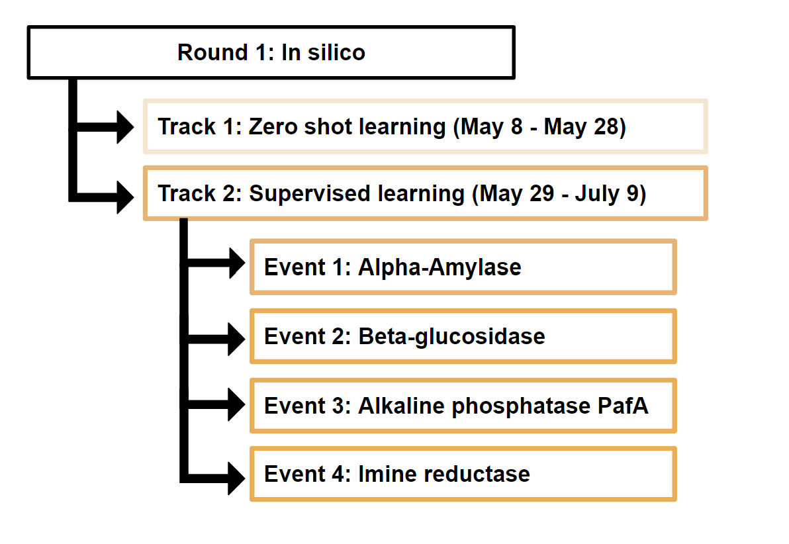

# ProteinEngineeringTournament
This repository describes the work that we have done for the second track of the first round for the protein tournament Competition, supported by Align To Innovate team. It consists of predicting the activity, expressibility, and stability of enzymes in both zero-shot and supervised tasks.

